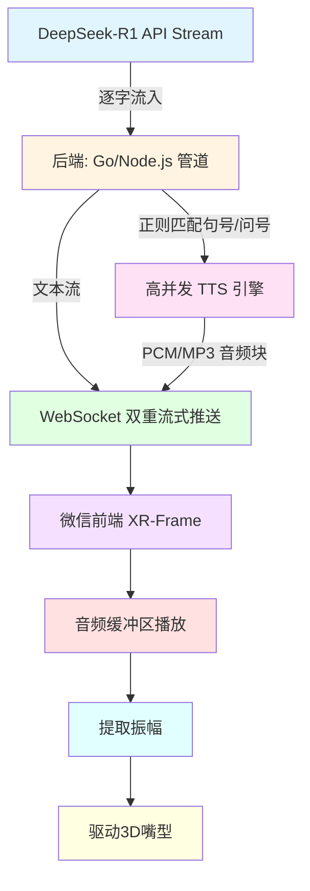

# AI面试系统架构流程图

## 流程说明

1. **DeepSeek-R1 API (Stream)** - 流式输出AI回答内容
2. **后端管道** - Go/Node.js处理流式数据，通过正则匹配句号/问号进行分句
3. **TTS引擎** - 高并发文本转语音，生成PCM/MP3音频块
4. **WebSocket推送** - 双重流式推送文本流和音频流
5. **微信前端XR-Frame** - 接收数据并渲染3D场景
6. **音频播放** - 缓冲区播放音频
7. **振幅提取** - 实时提取音频振幅数据
8. **3D嘴型驱动** - 根据振幅数据驱动3D模型嘴型动画
